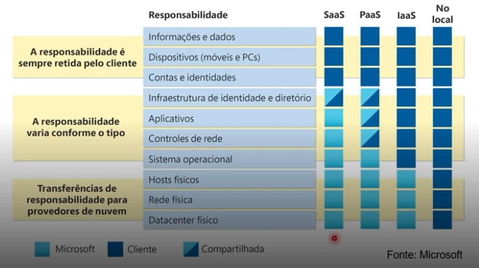

# **RESUMO LAB 03**

### **Tipos de Serviço de Nuvem na Azure**

Na Azure, os serviços são organizados em **três modelos principais**:
**IaaS (Infraestrutura como Serviço)**, **PaaS (Plataforma como Serviço)** e **SaaS (Software como Serviço)**.
A grande diferença entre eles é **o quanto você quer gerenciar*- e **o quanto a Microsoft gerencia por você**.

---

### **1. IaaS – Infraestrutura como Serviço**

Você **aluga a infraestrutura bruta** da Azure – servidores, rede, armazenamento, etc.
Com IaaS, **você tem muito controle**, mas também **mais responsabilidades**. É como alugar um apartamento "na planta": a estrutura está lá, mas você precisa cuidar de tudo dentro.

#### Vantagens:

- Flexibilidade total para instalar o que quiser.
- Ótimo para migração de sistemas legados (aplicações antigas que ainda funcionam bem).
- Ideal para testes e desenvolvimento com controle completo do ambiente.

#### Você é responsável por:

- Sistema operacional, atualizações, segurança do SO.
- Aplicações, dados, configurações de rede.

---

### **2. PaaS – Plataforma como Serviço**

PaaS oferece **um ambiente pronto para desenvolvimento e hospedagem de aplicativos**, sem você se preocupar com o sistema operacional ou configurações de servidores.
Você foca **só no código da sua aplicação**, e a Azure cuida do resto.

#### Vantagens:

- Economiza tempo com infraestrutura.
- Fácil de escalar aplicações conforme a demanda.
- Ótimo para DevOps, CI/CD e microserviços.

#### Você é responsável por:

- O código da sua aplicação.
- Dados armazenados e como são usados.

---

### **3. SaaS – Software como Serviço**

É o modelo mais simples: **você usa um software pronto** fornecido pela Microsoft, direto do navegador ou aplicativo.
Não precisa instalar, configurar ou manter servidores – **é só usar**.

#### Vantagens:

- Rápido de começar a usar.
- Custos previsíveis (normalmente por assinatura).
- Atualizações e segurança totalmente gerenciadas pela Microsoft.

#### Você é responsável por:

- Usar o serviço corretamente.
- Proteger seus dados com senhas fortes e boas práticas de acesso.

---

### **Modelo de Responsabilidade Compartilhada**

Esse modelo define claramente **quem é responsável por cada parte da solução em nuvem**: você (cliente) ou a Microsoft (Azure).
É importante entender que, **mesmo usando a nuvem, a responsabilidade total nunca é 100% da Microsoft**.

#### Como funciona?

**Resumo**:
- Quanto mais "pronta" é a solução (como no SaaS), menos responsabilidade você tem.

- Quanto mais "crua" a solução (como no IaaS), mais controle — e mais responsabilidade — você tem.

- Segurança dos dados e controle de acesso sempre são sua responsabilidade, mesmo com a melhor nuvem do mundo

> **No IaaS**, você faz quase tudo – mas tem liberdade total.

> **No PaaS**, você só se preocupa com o código e os dados.

> **No SaaS**, você só usa. A Microsoft cuida do resto.

**Segurança e dados do usuário são SEMPRE sua responsabilidade**, mesmo que a infraestrutura seja da Azure.

## **Criar Instância de SQL no Azure**
[Clique aqui para saber mais](SQL-Managed-Instance.md)
